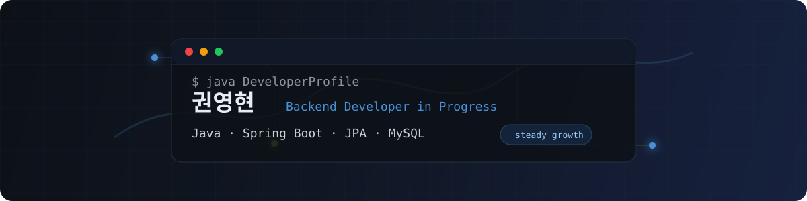

<div align="center">
  
</div>

<br/>

## About

```java
public class Developer {

    private final String name  = "권영현";
    private final String email = "rnjsdudgus0808@naver.com";
    private final String blog  = "https://velog.io/@dudgus0808/posts";

    private final String[] focus  = { "Backend Development", "Java Ecosystem" };
    private final String[] values = { "Problem Solving", "Clean Architecture", "Steady Growth" };

    public String getGoal() {
        return "기본에 충실한, 꾸준히 성장하는 백엔드 개발자 준비생";
    }
}
```

<br/>

## Tech Stack

**Language**

<div>
  
</div>

<br/>

**Backend**

<div>
  
  
  
  
</div>

<br/>

**Database**

<div>
  
</div>

<br/>

---

<br/>

## Projects

| Project | Type | Description |
| --- | --- | --- |
| [e-commerce](https://github.com/0younge/e-commerce) | Team Project | 이커머스 도메인을 기반으로 기능을 설계하고 구현한 팀 프로젝트 |

<br/>

---

<br/>

## Posts

> 차근차근 정리해서 채워가는 중입니다.

→ [블로그 더 보기](https://velog.io/@dudgus0808/posts)

<br/>

---

<br/>

## GitHub

<div align="center">
  
  
</div>

<div align="center">
  
</div>

<br/>

---

<br/>

## Contact

<div>
  <a href="mailto:rnjsdudgus0808@naver.com">
    
  </a>
  <a href="https://velog.io/@dudgus0808/posts">
    
  </a>
</div>

<br/>

<div align="center">
  
</div>

<br/>

<div align="center">
  <sub>기본기를 쌓고, 기록하고, 꾸준히 나아갑니다.</sub>
</div>
